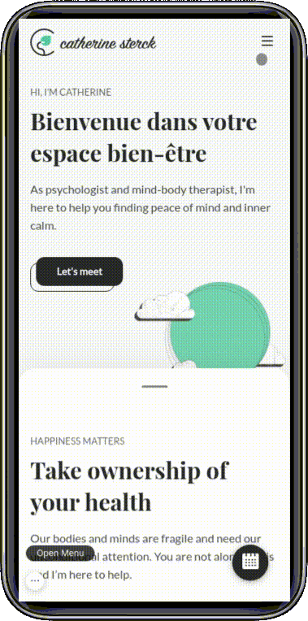
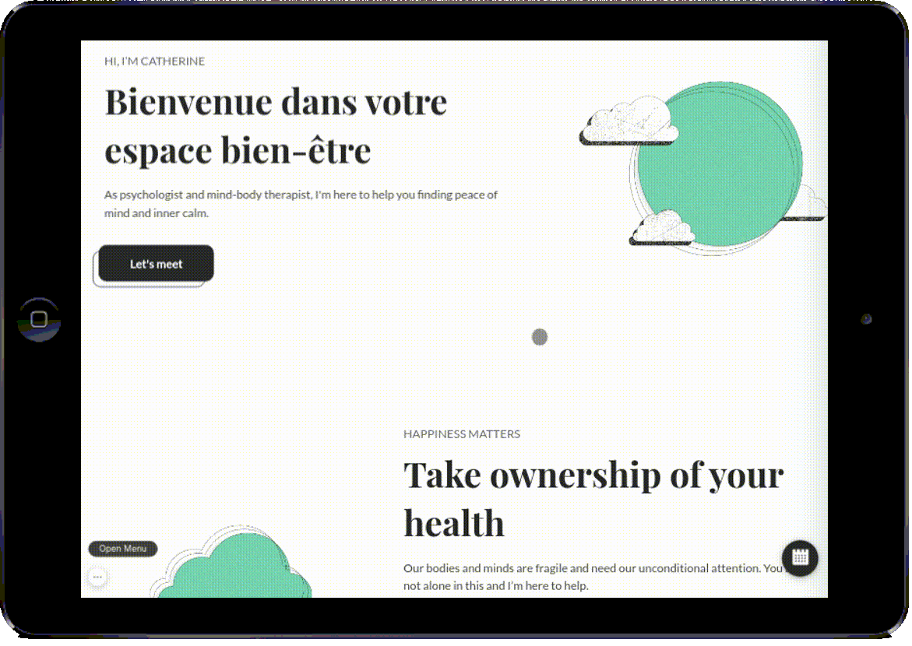
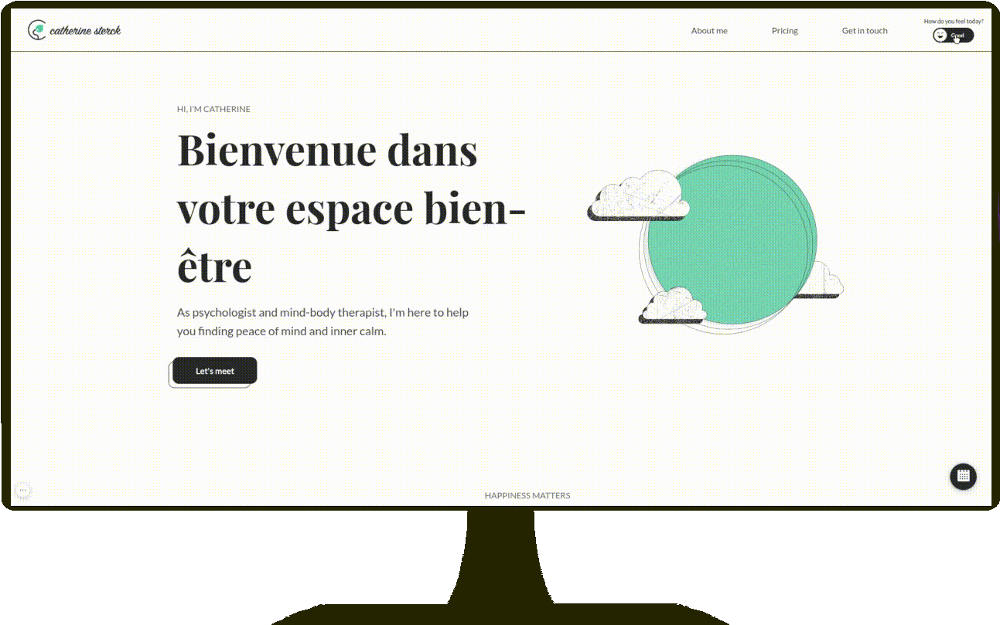
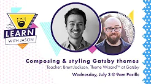

<div align="center">
    <!--  -->
    <h1>Website & Widget Booking conception</h1>
</div>

<br/>

<div align="center">


</div>

<br/>

<div align="center">


</div>

<br/>
<div align="center">

**Features:**
<span>Responsive</span> -
<span>EN-FR</span> - 
<span>Custom Booking Widget</span> -
<span>PWA</span> - 
<span>Dark Mode</span>
</div>

<br/>

<div align="center">
    &nbsp;&nbsp;
    &nbsp;&nbsp;
     &nbsp;&nbsp;
</div>

<br/>
<br/>

<div align="center">

[live demo](https://demo-website-booking-widget.netlify.app/fr/)

_NB: The demo is a fork of the real project. Feel free to use the plugin to book a fake appointment_

</div>


<br/>


# The client

Catherine Sterck is a Belgian psychologist and mind-body therapist. She practices in Brussels (Belgium) and has more than 20 years of experience in psychoanalysis.

# The problem

Catherine wanted a site who reflect her personality, I start the project with an interview to know more about Catherine. She wanted a multilang website with lots of information, animations, a light/dark version, and a fully-custom calendar plugin so that she could manage easily her schedule.

# An Agile & remote experience

As a developer I was not confident enough on my design abilities to make this project awesome. I asked to my very talented brother, Nicolas Henrot, designer based in London to collaborate on this project especially for UI/UIX and brand matters.
We decide to start the project with an Agile approach with the help of amazing tools like **Miro**, **Trello**, **Slack** or even **Zoom**.

# Design & brand

see all process on [Nicolas Henrot Website](https://www.nicolashenrot.com/cath-sterck)

# Wich tools should I use?

Once the concept is born, I had to choice tools to make the website and the plugin alive.
I had already some experiences of building things with JS framework like VueJs or ReactJs but i needed a way to build good SEO and loading perfomance.

After some research, I decide to apply the [Jamstack](https://jamstack.org/) architecture with the use of **Gatsby** as site generator and **netlify** as serverless provider.

Jamstack gives to the front-end developer some Super Powers.

- All the backend is managed by netlify but still allow me to communicate with server via netlify lambda functions. 
- allow static Website to use dynamic data via some external api
- Site is blazing fast thanks to the preload of static assets
- I can use React to build the site (used inside Gatsby himself). Thanks to that, I will reuse easily my components for next projects 

# What did I learn?

When i start the project i was coding from 2 years. This project should reflect all abilities of my junior experience as a full stack JS developer. I still learn a lot during this journey. Here is a non exhaustiv list of questions who gives me some headaches :)

- **how to build a plugin with gatsby?**

I struggle some times on the correct approach of building a gatsby-theme and gatsby-plugin. Gatsby is in my opinion a wonderful tool but you need some time to really understand all his features. [Jason Lengstorf](https://www.youtube.com/c/Lengstorf/videos) youtube Videos help me a lot to learn all stuff from gatsby

[](https://youtu.be/6Z4p-qjnKCQ)

- **what is the correct way to build a bilingual site?**

I used react-intl to allow internationalization to Catherine site.
All the texts are stocked on a json file. The process needs to be improved in the future to make text changes easier for the customer side.


- **How connect the google-calendar-api to my gatsby project?**

Serverless solutions allow us to communicate with the backend of our site via lambda functions.

I struggled a lot to set up a netlify lambda function for managing the **google-calendar-api**. I spent some entirely nights to understand how to use correctly the google api with a javascript solution.

Here is the netlify function script to fetch the available slots from the google-calendar:

```js
require("dotenv").config();
const { google } = require("googleapis");
import { addWeeks, startOfWeek, endOfWeek } from "date-fns";

exports.handler = async (event) => {
  const eventParsed = JSON.parse(event.body);
  const { CLIENT_EMAIL, PRIVATE_KEY } = process.env;
  const clientEmail = `${CLIENT_EMAIL}`;
  const privateKey = `${PRIVATE_KEY}`;
  const scopes = ["https://www.googleapis.com/auth/calendar"];
  const timeMin = eventParsed.timeMin ? eventParsed.timeMin : 0;
  const timeMax = eventParsed.timeMax;
  const calendarId = process.env[eventParsed.calendar];
  const eventDefaultName = eventParsed.eventDefault;
  try {
    console.log("TRY", eventParsed, calendarId, clientEmail, privateKey);
    const token = await getAuthToken();
    const res = await getCalendarValues(calendarId, token);
    return {
      statusCode: 200,
      isBase64Encoded: false,
      headers: { "Content-Type": "application/json" },
      body: JSON.stringify({ result: res.data }),
    };
  } catch (err) {
    return {
      statusCode: err.statusCode || 500,
      body: JSON.stringify({ error: err.message }),
    };
  }
  async function getAuthToken() {
    const authToken = await google.auth.getClient({
      credentials: {
        client_email: clientEmail,
        private_key: privateKey.replace(/\\n/g, "\n").trim(),
      },
      scopes: scopes,
    });
    return authToken;
  }
  async function getCalendarValues(id, auth) {
    const calendar = google.calendar({ version: "v3", auth });
    const res = await calendar.events.list({
      calendarId: id,
      timeMin: startOfWeek(addWeeks(new Date(), timeMin),{weekStartsOn:1}),
      maxResults: 1000,
      timeMax: endOfWeek(addWeeks(new Date(), timeMax),{weekStartsOn:1}),
      singleEvents: true,
      orderBy: "startTime",
      q: eventDefaultName,
    });
    return res;
  }
};

```

- **Am I Alone in the dark?**

Even I had daily contact with my brother and colleague Nicolas, I felt alone some times for the more difficult part of the development process. One think i realize is that I want to work with other developers in the future. Maybe you?

- **How to build A design system?**

This website will be the first of - hopefully - many websites in the future. We shouldn’t only build a “one-shot” website but building a whole Design System that will allow us to be way faster for our next projects.

I worked with the plugin **gatsby-theme-docz** to manage the design-system. Docz give me the environment to test all reusable components before we integrate them to the site and plugin.

You can check our design system (WIP) here. We decide to build it with an [**atomic**](https://atomicdesign.bradfrost.com/) approach

# Animations

Most of the animations are made with the help of [react-spring]().