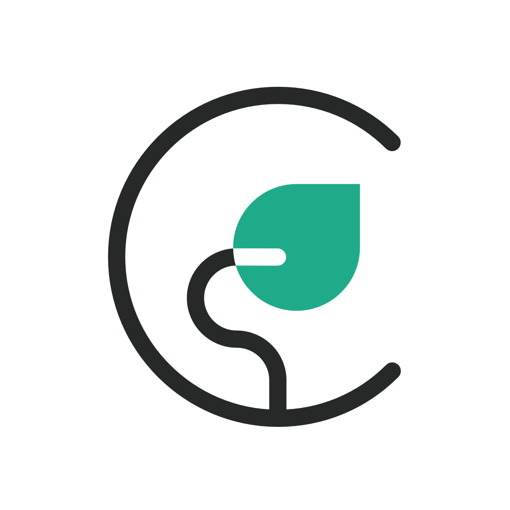

    &nbsp;&nbsp;
    &nbsp;&nbsp;
     &nbsp;&nbsp;

 

    <!--  -->
    <h1>Website & Widget Booking conception</h1>

 
 

###

###

[live demo]()

_NB: The demo is a fork of the real project. Feel free to use the plugin to book a fake appointment_

# Features

## Responsive

# The client

Catherine Sterck is a Belgian psychologist and mind-body therapist. She practices in Brussels (Belgium) and has more than 20 years of experience in psychoanalysis.

# The problem

Catherine wanted a site who reflect her personality, I start the project with an interview to know more about Catherine. She wanted a multilang website with lots of information, animations, a light/dark version, and a fully-custom calendar plugin so that she could manage easily her schedule.

# An Agile & remote experience

As a developer I was not confident enough on my design abilities to make this project awesome. I asked to my very talented brother, Nicolas Henrot, designer based in London to collaborate on this project especially for UI/UIX and brand matters.
We decide to start the project with an Agile approach with the help of amazing tools like **Miro**, **Trello**, **Slack** or even **Zoom**.

# Design & brand

see all process on [Nicolas Henrot Website](https://www.nicolashenrot.com/cath-sterck)

# Wich tools should I use?

Once the concept is born, I had to choice tools to make the website and the plugin alive.
I had already some experiences of building things with JS framework like VueJs or ReactJs but i needed a way to build good SEO and loading perfomance.

After some research, I decide to apply the JAM stack architecture approach with the use of **Gatsby** as site generator and **netlify** as headless CMS.

The benefits of this stack are :

- faster performance
- more secure
- less expensive
- better developper experience
- scalability

# Welcome to the jungle

When i start the project i was coding from 2 years. I learned a lot very quickly and this project should reflect all abilities of my junior experience as a full stack JS developer. I still learn a lot during this journey. Here is a non exhaustiv list of questions who gives me some headache :)

- how to build a plugin with gatsby?

I struggle some times on the correct approach of building a gatsby-theme in the good way. Gatsby is in my opinion a wonderful tool but you need some time to really understand all his features. Json Machin was my favourite youtube channel during all the project ^^

- what is the correct way to build a site multilang?

- Can I use static site with static data with a widget who needs dynamic data

- Is google-calendar API really a pain in the \*\*\*\*

Honnestly? Yes it is... Especially for beginners in backend. I spent some entirely night to understand how to use correctly their api. I guess I'm not the only one ^^

- Alone in the dark

Even I had daily contact with my brother and colleague Nicolas, I felt alone some times for the more difficult part of the development process. One think i realize is that I want to work with other developers in the future. Maybe you?

# A reusable plugin

The calendar widget is designed for gatsby site. More about the plugin conception here

# A design system

This website will be the first of - hopefully - many websites in the future. We shouldn’t only build a “one-shot” website but building a whole Design System that will allow us to be way faster for our next projects.

I worked with the plugin gatsby-theme-docz to manage the design-system. Docz give me the environment to test all reusable components before we integrate them to the site and plugin.

You can check our design system (WIP) here.

# And Next?
